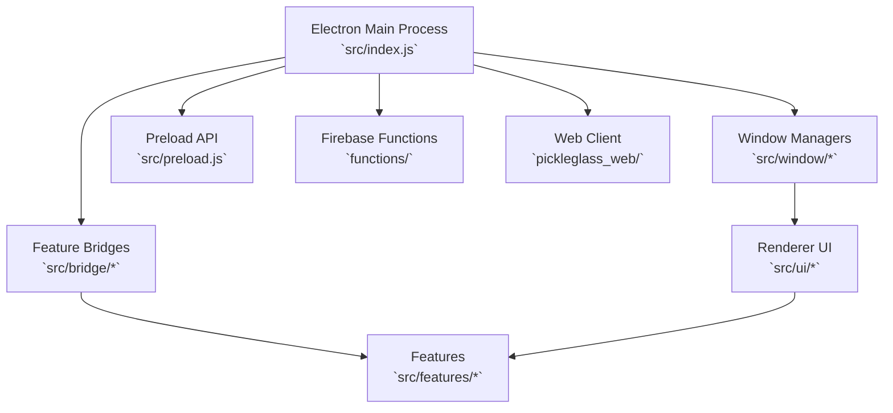

# Architecture Overview

This document provides a high-level view of the Glass project and its major components.

## Components

- **Desktop Application (`src/`)**
  - `index.js` – Electron main process that bootstraps windows, services and protocol handling.
  - `bridge/` – Bridges used for communication between features and windows.
  - `features/` – Feature modules (`ask`, `listen`, `settings`, `shortcuts`) built around a service‑repository pattern.
  - `window/` – Creation, layout and animation of application windows.
  - `ui/` – Lit-based renderer views for user interaction.
  - `preload.js` – Secure API surface exposed to renderer processes.
- **Web Application (`pickleglass_web/`)** – Next.js frontend for cloud dashboard functionality.
- **Firebase Functions (`functions/`)** – Cloud functions used for authentication and other backend tasks.

## High-Level Flow

