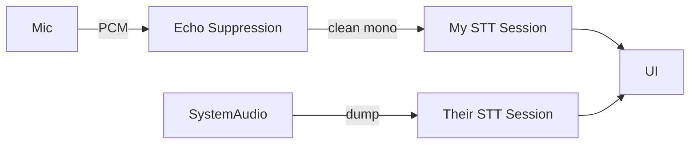

# Speech-to-Text (STT) and Audio Separation

Glass provides real-time speech transcription by running separate STT sessions for each side of a conversation. The **SttService** maintains two WebSocket sessions (`mySttSession` and `theirSttSession`) and tracks partial and final utterances for "Me" and "Them" independently. This allows the app to identify who is speaking and handle both microphone and system audio streams.

## Architecture Overview

## Session Management

- A keep-alive ping is scheduled every minute and sessions are automatically renewed every 20 minutes to avoid provider timeouts.
- When the sessions are renewed, the old and new sockets overlap briefly to prevent missing packets.
- Completion buffers and debounced timers aggregate partial transcripts before sending final results to the UI.

## Noise Filtering and Turn Detection

- Whisper transcripts are filtered for noise markers (e.g., `"[BLANK_AUDIO]"`, `"[NOISE]"`) so only meaningful speech is emitted.
- Gemini and Deepgram interim results are likewise screened for `<noise>` tokens or empty text before being added to the buffers.
- Providers like OpenAI enable server-side voice activity detection to better detect speaker turns.
- The capture layer drops PCM frames whose RMS falls below an `isVoiceActive` threshold so pure background noise is never sent to the STT sessions, saving tokens.

## Audio Capture and Separation

- For macOS the service spawns a [`SystemAudioDump` helper](./mac_audio_dump.md) to capture system audio. Captured chunks are converted from stereo to mono before being base64 encoded and forwarded to the "Them" session.
- Microphone audio is processed separately through the "Me" session, keeping the two speakers distinct.

## Acoustic Echo Suppression (AES)

The STT pipeline can optionally load a WebAssembly **AES** module (`src/ui/listen/audioCore/aec.js`) to remove playback from the microphone feed. The module subtracts the system audio stream from the live microphone PCM before the cleaned data is passed to `mySttSession`, preventing remote voices from being retranscribed.

## Sound Enhancements

- OpenAI's realtime STT session is configured with `input_audio_noise_reduction: { type: 'near_field' }` to suppress background noise and with server VAD parameters for accurate turn detection.
- Additional filtering in the service removes very short or blank utterances to reduce false positives.

## Supported Providers

The factory module can initialize STT sessions for multiple providers (OpenAI, Gemini, Deepgram, Whisper, Anthropic placeholder). Each provider receives callbacks for message handling and error reporting, but all follow the same send/close interface so the service can swap providers transparently.
